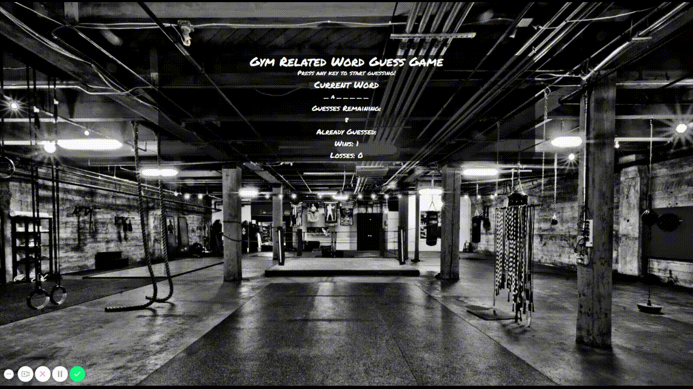

# Word Guess Game
A simple, gym themed, word guess game.

## Instructions
Press letters on your keyboard to make a guess. Good luck!

## What It Teaches
Learning how to use Javascript, mainly looking at using key press events and how to display information on the screen.

## Languages/Technologies 
* HTML
* CSS
* JavaScript

## Demo

## Future Development/Improvements
- [ ] Mobile Responsive
- [ ] Change alert to modal
- [ ] Add more words

## Links
[Deployed Link](https://lmboyle.github.io/Word-Guess-Game)

[Portfolio](https://lmboyle.github.io/)
